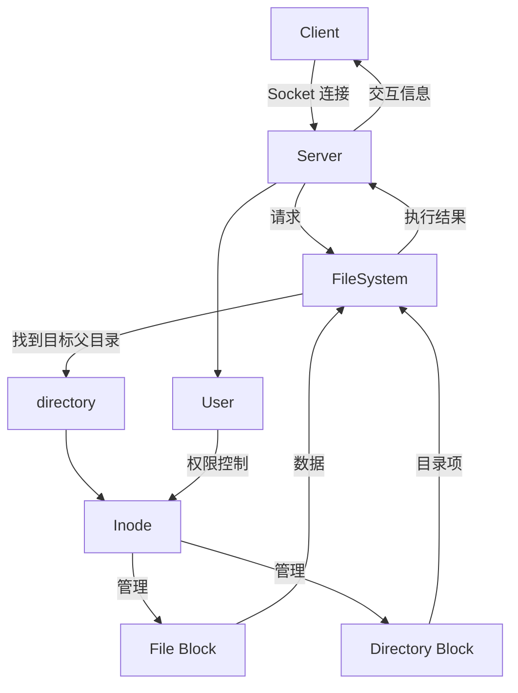

# Inode_system

## 项目概述
`Inode_system` 是一个用 C 语言实现的模拟文件系统。项目采用 iNode 结构管理文件和目录，并支持基本的文件系统操作，如创建、删除、读取、写入、重命名、复制和移动文件及目录。该系统通过多线程实现，并使用互斥锁确保数据一致性。`Inode_system` 还支持通过客户端-服务器架构进行网络交互。

## 文件系统框架图
以下是 `Inode_system` 的整体框架图，展示了系统的主要组件及其交互关系：



## 功能
1. **文件及目录操作**：
   - **创建目录**：`mkdir <path>`
     - 示例：`mkdir /home/user/new_folder`
   - **删除目录**：`rmdir <path>`
     - 示例：`rmdir /home/user/new_folder`
   - **列出目录内容**：`ls <path>`
     - 示例：`ls /home/user`
   - **创建文件**：`mkfile <path>`
     - 示例：`mkfile /home/user/document.txt`
     - 后续输入：文件内容、文件权限
   - **删除文件**：`rmfile <path>`
     - 示例：`rmfile /home/user/document.txt`
   - **读取文件**：`read <path>`
     - 示例：`read /home/user/document.txt`
   - **写入文件**：`write <path>`
     - 示例：`write /home/user/document.txt`
     - 后续输入：新文件内容
   - **重命名文件**：`renameFile <path>`
     - 示例：`renameFile /home/user/document.txt`
     - 后续输入：新文件名
   - **重命名目录**：`renameDirectory <path>`
     - 示例：`renameDirectory /home/user/new_folder`
     - 后续输入：新目录名
   - **复制文件**：`cpfile <path>`
     - 示例：`cpfile /home/user/document.txt`
     - 后续输入：目标路径
   - **移动文件**：`mvfile <path>`
     - 示例：`mvfile /home/user/document.txt`
     - 后续输入：目标路径
   - **链接文件**：`ln <path>`
     - 示例：`ln /home/user/document.txt`
     - 后续输入：要链接的文件路径
   - **切换目录**：`cd <path>`
     - 示例：`cd /home/user`

2. **用户管理**：
   - **创建用户**：`createUser`
     - 示例：`createUser`
     - 后续输入：用户名、密码、权限
   - **删除用户**：`delUser <username>`
     - 示例：`delUser user123`
   - **切换用户**：`su <username>`
     - 示例：`su user123`
     - 后续输入：密码

3. **权限管理**：实现了简单的用户权限管理，支持不同用户角色（如管理员、医生、患者）对文件和目录的不同访问权限。

4. **持久化**：可以将文件系统状态保存到磁盘并从中加载。

5. **网络交互**：支持客户端与服务器之间的网络通信，允许远程文件操作。

6. **多线程支持**：使用 pthread 互斥锁确保线程安全。

## 目录结构
- `fileSystem.c`：文件系统核心功能的实现。
- `fileSystem.h`：头文件，包含项目中使用的结构体和函数原型。
- `client.c`：客户端代码，用于与服务器进行网络通信。
- `server.c`：服务器代码，处理客户端请求。
- `README.md`：项目说明文档。

## 安装
在安装项目之前，请确保您已经安装了 GCC 编译器和必要的库。

1. 克隆项目到本地：
   ```bash
   git clone https://github.com/yourusername/Inode_system.git
   cd Inode_system
   ```

2. 编译代码：
   ```bash
   make all
   ```

## 运行
1. **启动服务器**：
   首先，启动服务器端来侦听客户端请求。
   ```bash
   ./server
   ```

2. **启动客户端**：
   然后，启动客户端以连接到服务器并执行命令。
   ```bash
   ./client
   ```

3. **使用指南**：
   使用客户端命令行界面输入相关指令进行文件系统操作。可以创建、读取、写入、删除、重命名、复制和移动文件及目录。输入“quit”退出客户端。

## 用户权限
- **管理员**：拥有所有操作权限。
- **医生**：可以管理与其相关的患者文件。
- **患者**：只能访问和管理自己的文件。

## 注意事项
- 确保在多用户环境中使用时，正确设置用户权限以避免数据冲突。
- 在进行文件系统操作时，确保服务器和客户端的连接正常。